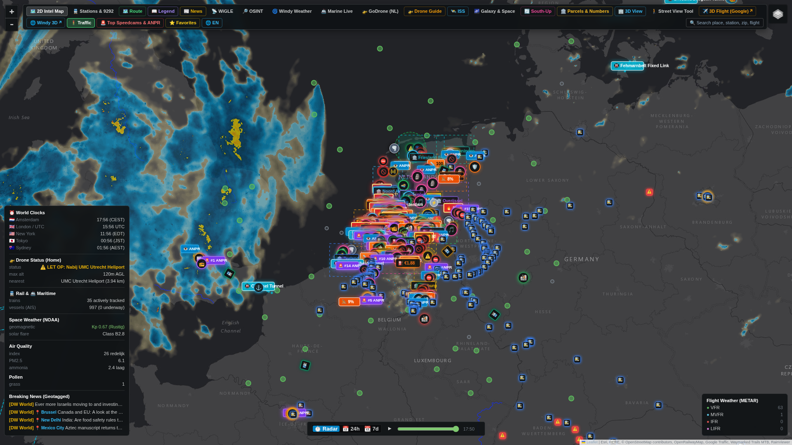

# Earth Monitor — Live World Map, Flights, Weather & News

A single, always-available bar widget for [Omarchy](https://omarchy.org) that puts a full interactive world map, live weather, aircraft, ships, trains, cyber threat intel, breaking news, and 50+ optional live-data layers behind one click.

 




## Features

- **Interactive world map** (Leaflet) with multiple base layers: dark, OpenStreetMap, topo, Google Maps/Satellite/Hybrid/Terrain, Esri Satellite, light.
- **50+ opt-in overlay layers**, including: live weather radar, wind, air quality, civil and military aircraft, maritime/AIS traffic, trains and rail disruptions, drone no-fly zones, earthquakes and natural disasters, nuclear facilities, military bases, conflict/geopolitical hotspots, submarine communication cables, oil/gas pipelines, cyber security advisories (CISA KEV feed), geotagged breaking news, worldwide internet radio stations, public webcams, solar day/night terminator, and live ISS orbit tracking.
- **Route planner**: multi-modal directions (car/bike/foot) via OSRM, with region-aware fuel/EV/transit/taxi cost estimates and one-click hand-off to Google Maps, TomTom, Waze, Apple Maps.
- **Live curated news & radio panel**, filterable by category, with a "open in real browser" fallback for sites that block being embedded.
- Full English/Dutch UI.

## Installation

1. Open the Omarchy plugin marketplace / settings, or clone directly:
   ```bash
   git clone https://github.com/PietjePuh/omarchy-earth.git \
     ~/.config/omarchy/plugins/io.github.pietjepuh.earth
   ```
2. Restart the Omarchy shell (or run `omarchy restart shell`).
3. The 🌍 icon appears in the bar. Click it to open the map.
4. Optional: set your home coordinates in the plugin's settings panel (defaults to a generic Netherlands-wide view, not tied to any specific address).

No external accounts, API keys, or paid services are required — every data source used is free and keyless (see **Data sources & attribution** below).

## Removal

```bash
rm -rf ~/.config/omarchy/plugins/io.github.pietjepuh.earth
omarchy restart shell
```
No other files are created or modified outside this plugin's own directory and its own cache folder (`~/.cache/omarchy-earth/`), which can also be safely deleted.

## Dependencies

- **Runtime**: Python 3 standard library only (no `pip install` needed) for the backend data sampler; [Leaflet.js](https://leafletjs.com/) (loaded from CDN) for the map frontend.
- **Host**: Omarchy 4.x / Quickshell, as with any other bar-widget plugin.

## Data sources & attribution

All data sources are free, public, keyless APIs/feeds. This plugin performs light, infrequent polling (default every 5 minutes) and does not require or store any account credentials:

Open-Meteo, RainViewer, ADSB.lol, USGS Earthquakes, GDACS, NOAA SWPC, Radio Browser (radio-browser.info), CISA KEV, NCSC-NL advisories, aviationweather.gov, Digitraffic (Finland), NDW (Dutch road data), Buienradar, OpenStreetMap/Nominatim, OSRM, and public RSS feeds from NOS, BBC, Al Jazeera, Reuters/DW/Euronews/Guardian/Politico and other named outlets for the news layer.

## License

MIT — see [LICENSE](LICENSE).

## Maintainer notes

Actively developed. Built for personal daily use, then generalized and open-sourced. Issues and PRs welcome; response time is best-effort, not guaranteed.
