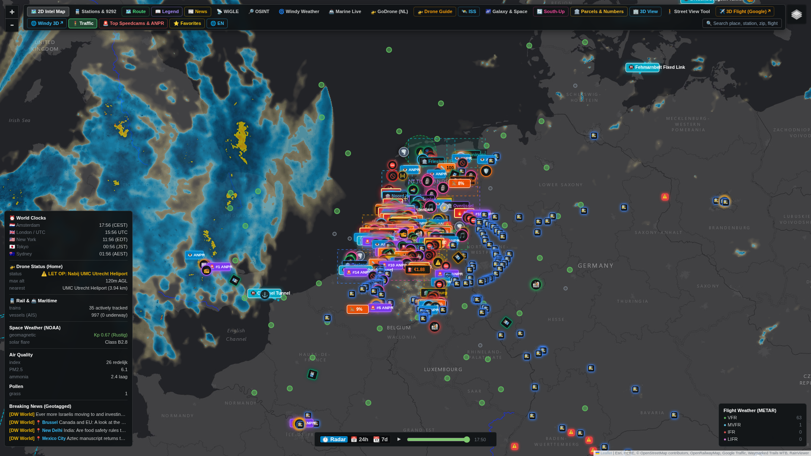

# Earth Monitor — Live World Map, Flights, Weather & News

A single, always-available bar widget for [Omarchy](https://omarchy.org) that puts a full interactive world map, live weather, aircraft, ships, trains, cyber threat intel, breaking news, and 50+ optional live-data layers behind one click.

 




## Features

- **Interactive world map** (Leaflet) with multiple base layers: dark, OpenStreetMap, topo, Google Maps/Satellite/Hybrid/Terrain, Esri Satellite, light.
- **50+ opt-in overlay layers**, including: live weather radar, wind, air quality, civil and military aircraft, maritime/AIS traffic, trains and rail disruptions, drone no-fly zones, earthquakes and natural disasters, nuclear facilities, military bases, conflict/geopolitical hotspots, submarine communication cables, oil/gas pipelines, cyber security advisories (CISA KEV feed), geotagged breaking news, worldwide internet radio stations, public webcams, solar day/night terminator, and live ISS orbit tracking.
- **Route planner**: multi-modal directions (car/bike/foot) via OSRM, with region-aware fuel/EV/transit/taxi cost estimates and one-click hand-off to Google Maps, TomTom, Waze, Apple Maps.
- **Live curated news & radio panel**, filterable by category, with a "open in real browser" fallback for sites that block being embedded.
- Full English/Dutch UI.

## Installation

1. Open the Omarchy plugin marketplace / settings, or clone directly:
   ```bash
   git clone https://github.com/PietjePuh/omarchy-earth.git \
     ~/.config/omarchy/plugins/io.github.pietjepuh.earth
   ```
2. Restart the Omarchy shell (or run `omarchy restart shell`).
3. The 🌍 icon appears in the bar. Click it to open the map.
4. Optional: set your home coordinates in the plugin's settings panel (defaults to a generic Netherlands-wide view, not tied to any specific address).

No external accounts, API keys, or paid services are required — every data source used is free and keyless (see **Data sources & attribution** below).

## Layer & Data Source Key Inventory

The plugin defaults to keyless, open endpoints for all layers. No mandatory API keys are required for standard operation.

| Layer / Feature | Default Source | Status / Keyless Equivalent | Optional Keyed Source |
| :--- | :--- | :--- | :--- |
| **Base Map Tiles** | Esri World Imagery, OpenStreetMap, OpenTopoMap, Carto/Esri Dark/Light, Google Maps public tiles | Keyless / Open Tiles | None required |
| **Rain Radar (Global Timeline)** | RainViewer Public API | Keyless / Open API | None required |
| **High-res Radar (US CONUS)** | NOAA/NWS MRMS GeoServer | Keyless / Open WMS | None required |
| **High-res Radar (DE/Central EU)** | DWD Niederschlagsradar GeoServer | Keyless / Open WMS | None required |
| **Weather & Nowcast** | Open-Meteo & Buienradar raintext | Keyless / Open API | None required |
| **Air Quality & Pollen** | Open-Meteo Air Quality API | Keyless / Open API | None required |
| **Civil & Military Flights** | ADSB.lol public API (`/v2/point`, `/v2/mil`) | Keyless / Open API | None required |
| **Vessels & Maritime Traffic** | Digitraffic Finland Marine AIS API | Keyless / Open API | None required |
| **Trains & Rail Disruptions** | TrainsTracking Realtime & Rijden de Treinen RSS | Keyless / Open Feeds | None required |
| **Earthquakes & Disasters** | USGS GeoJSON & GDACS Events API | Keyless / Open Feeds | None required |
| **Satellites & ISS Tracking** | CelesTrak TLE GP & WhereTheISS.at | Keyless / Open API | None required |
| **Fire Detections** | NASA EONET v2.1 Events API | Keyless / Open API | NASA FIRMS (Optional Keyed) |
| **Internet Radio Directory** | Radio Browser (`de1.api.radio-browser.info`) | Keyless / Open Directory | None required |
| **News Feeds & Threat Intel** | Public RSS Feeds (NOS, BBC, Al Jazeera, Reuters/DW, CISA, NCSC-NL) | Keyless / Open RSS | None required |
| **Flight Log Sighting** | AirTrail Personal Instance (`/api/flight/save`) | Keyed Opt-in (User self-hosted server token) | AirTrail Server API Key |

## Removal

```bash
rm -rf ~/.config/omarchy/plugins/io.github.pietjepuh.earth
omarchy restart shell
```
No other files are created or modified outside this plugin's own directory and its own cache folder (`~/.cache/omarchy-earth/`), which can also be safely deleted.

## Dependencies

- **Runtime**: Python 3 standard library only (no `pip install` needed) for the backend data sampler; [Leaflet.js](https://leafletjs.com/) (loaded from CDN) for the map frontend.
- **Host**: Omarchy 4.x / Quickshell, as with any other bar-widget plugin.

## Data sources & attribution

All data sources are free, public, keyless APIs/feeds. This plugin performs light, infrequent polling (default every 5 minutes) and does not require or store any account credentials:

Open-Meteo, RainViewer, NOAA/NWS MRMS (opengeo.ncep.noaa.gov GeoServer, CONUS hi-res radar), DWD (maps.dwd.de GeoServer, German + neighbouring hi-res radar), ADSB.lol, USGS Earthquakes, GDACS, NOAA SWPC, Radio Browser (radio-browser.info), CISA KEV, NCSC-NL advisories, aviationweather.gov, Digitraffic (Finland), NDW (Dutch road data), Buienradar, OpenStreetMap/Nominatim, OSRM, and public RSS feeds from NOS, BBC, Al Jazeera, Reuters/DW/Euronews/Guardian/Politico and other named outlets for the news layer.

### Radar layers

- **Rain Radar** (default on, in the timeline bar): RainViewer, global coverage, ~10-minute frames, up to 2h of history + short nowcast — the only source with a historical scrubber.
- **📡 NOAA Hi-res Radar** (Layer Manager, opt-in): US/CONUS-only MRMS composite reflectivity, ~1km resolution. Latest frame only, no scrubber.
- **📡 DWD Hi-res Radar** (Layer Manager, opt-in): German `Niederschlagsradar`, covers Germany and its immediate neighbours. Latest frame only, no scrubber.

Both regional overlays stack on top of the RainViewer timeline and are useful when travelling in/near their coverage area for sharper detail than RainViewer's global tiles offer; outside their footprint they render nothing (transparent).

### Log a live sighting to AirTrail (optional)

If you self-host [AirTrail](https://github.com/johanohly/AirTrail) (an open-source personal flight log), every civil and military aircraft popup gets a **📝 Log to AirTrail** button. On click it:

1. Resolves the aircraft's live callsign to a route via [adsbdb.com](https://api.adsbdb.com) (free, keyless).
2. POSTs a flight entry (route, aircraft type/registration, a timestamped note) to your AirTrail instance's `/api/flight/save` endpoint.

Expect frequent "no route found" results for military, GA, and private flights — adsbdb only resolves scheduled commercial callsigns, there's no way around that from a single live ADS-B snapshot. The first click prompts for your AirTrail server URL and an API key (create one under AirTrail's Settings → Security → API Keys); both are stored in this browser's `localStorage` only and sent straight to your own server, never anywhere else.

## License

MIT — see [LICENSE](LICENSE).

## Maintainer notes

Actively developed. Built for personal daily use, then generalized and open-sourced. Issues and PRs welcome; response time is best-effort, not guaranteed.
